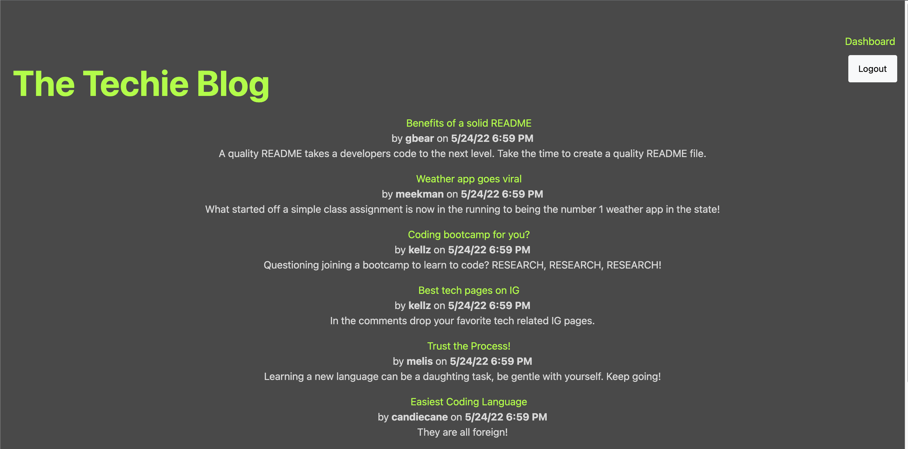

# The-Techie-Blog

<h1 align="center">The Techie Blog</h1>

## Table of Contents

* [Description](#description)
* [BuiltWith](#built-with)
* [Installation](#installation) 
* [Deployed Application](#deployed-application)
* [Contributor](#contributor)

## Description

The Techie Blog is a developer's dream appilcation. This app allows the user to sign up or login into an existing account, add posts and comments, and see a dashboard full of blog posts related to tech. The Techie blog follows the MVC architectural structure. Handlebars.js is used in the front end to assist with the views and Sequelize for the ORM. Let's checkout out a the vast community of web developers!

## Built With

* JavaScript
* Express
* MySQL
* Handlebars
* Sequelize
* Sessions

## Installation

1. Run `npm init -y` from the root directory to initialize a Node.js package

2. Update package.json to `"main": "server.js"`

3. Create `.gitignore` for node_modules

4. Run `npm i express sequelize mysql2`

## Deployed Application

[Heroku Deployment](https://intense-lake-68879.herokuapp.com/)

</img>

## GitHub Repository

[The Techie Blog](https://github.com/chloeyarb/The-Techie-Blog)

## Contributor

Chloe Yarborough

Connect with me on [GitHub](https://github.com/chloeyarb)!
